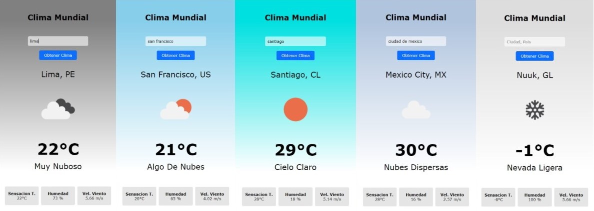

# App de clima

<p align="center">
  
</p>

Este proyecto es una aplicación web simple que muestra la información meteorológica actual de la ciudad que desees utilizando la API de OpenWeatherMap.

<p align="center">
  
  
  
  
</p>


## Descripción del proyecto

Esta es una aplicación web que te permite buscar el clima actual de cualquier ciudad del mundo. Utiliza la API gratuita de OpenWeatherMap para obtener datos meteorológicos en tiempo real.

## Demo

Puedes probar una demostración de la aplicación [aquí](URL_de_tu_demo).

## Características

- Búsqueda de ubicaciones por nombre de ciudad.
- Visualización del clima actual, incluyendo temperatura, humedad, velocidad del viento y descripción del clima.
- Cambio de aspecto visual de acuerdo al pronóstico.

## Uso

1. Clona este repositorio en tu máquina local:

   ```bash
     git clone https://github.com/tu_usuario/the-weather-app.git
   ```

2. Abre el archivo index.html en tu navegador web:

3. Introduce el nombre de una ciudad en el campo de búsqueda y presiona Enter o haz clic en el botón de búsqueda.

4. Observa los resultados que muestran el clima actual.

## Configuracion

Para utilizar esta aplicación, necesitarás una API key de OpenWeatherMap. Puedes obtener una API key registrándote en [OpenWeatherMap](https://openweathermap.org/)
y luego siguiendo estos pasos:

1. Renombra el archivo config.example.js por config.js

2. Abre el archivo config.js en un editor de texto y reemplaza 'YOUR_API_KEY' con tu API key de OpenWeatherMap.

## Tecnologías Utilizadas

- HTML
- CSS
- JavaScript
- OpenWeatherMap API

## Autor

Este proyecto fue desarrollado por [Victor Ccanchi](https://www.linkedin.com/in/victor-ccanchi/).

## Licencia

Este proyecto está bajo la Licencia MIT. Consulta el archivo [LICENSE](LICENSE) para más detalles.
